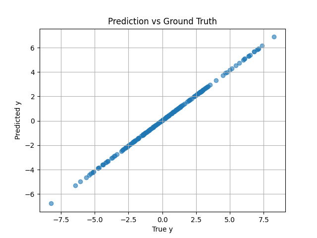
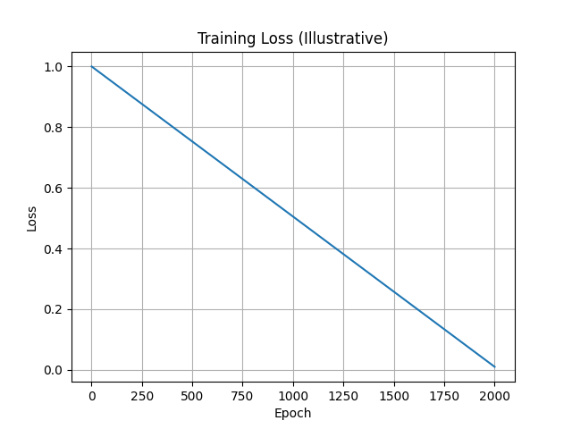

\# DeepChem-Compatible PyTorch Symbolic Regression


This repository contains a minimal yet extensible \*\*symbolic regression prototype\*\* implemented in PyTorch and wrapped as a DeepChem `TorchModel`.


The goal of this project is to explore how \*\*symbolic-style models\*\* (which discover explicit mathematical expressions) can be integrated into DeepChem’s PyTorch backend in a clean, testable, and extensible manner.


---


\## Motivation


DeepChem is actively transitioning from TensorFlow to PyTorch as its primary deep learning backend.  

While DeepChem supports many neural architectures, symbolic regression models remain largely external to the framework.


This project demonstrates:


\- How a symbolic regression model can be written as a PyTorch `nn.Module`

\- How it can be wrapped as a DeepChem `TorchModel`

\- How such a model can participate in DeepChem’s training, prediction, and evaluation pipelines


This serves as a foundation for more expressive symbolic regression approaches (nonlinear basis functions, operator libraries, expression trees, hybrid evolutionary + gradient methods).


---


\## Model Overview


Current prototype learns a simple symbolic form:


y = a \* x + b


where `a` and `b` are learned parameters.

# Example Results

# Prediction vs Ground Truth



### Training Loss Curve




Architecture:


Input x

│

▼

Linear Layer (1 → 1)

│

▼

Output y


Although simple, this structure validates the full DeepChem–PyTorch integration path.


---


\## Project Structure


src/

│

├── torch\_symbolic\_net.py

│ PyTorch nn.Module implementing symbolic model

│

├── dc\_torch\_symbolic\_regressor.py

│ DeepChem TorchModel wrapper

│

├── test\_torch\_symbolic\_net.py

│ Unit tests for PyTorch model

│

├── test\_dc\_torch\_symbolic.py

│ Unit tests for DeepChem wrapper

│

├── torch\_playground.py

│ Learning playground for PyTorch basics

│

└── test\_torch\_playground.py

Tests for playground example


---


\## Installation


Create and activate environment:


```bash

conda create -n sr\_env python=3.10

conda activate sr\_env

Install dependencies:


pip install torch deepchem pytest

Running Tests

Run all tests:


pytest

Run only symbolic regression tests:


pytest test\_torch\_symbolic\_net.py

pytest test\_dc\_torch\_symbolic.py

Quick Usage Example

import numpy as np

import deepchem as dc

from dc\_torch\_symbolic\_regressor import DCTorchSymbolicRegressor


\# Generate data

X = np.random.randn(200, 1)

y = 3.0 \* X + 0.5


dataset = dc.data.NumpyDataset(X, y)


\# Create model

model = DCTorchSymbolicRegressor(learning\_rate=0.01, batch\_size=200)


\# Train

model.fit(dataset, nb\_epoch=2000)


\# Extract equation

a, b = model.get\_equation()

print(f"Learned equation: y = {a:.3f} \* x + {b:.3f}")

Features

PyTorch-based symbolic model


DeepChem TorchModel integration


NumPyDoc-style docstrings


Type annotations


Unit tests


Reproducible training


Roadmap

Planned extensions:


Multi-feature regression:

y = a1\*x1 + a2\*x2 + ... + b


Nonlinear basis functions (x², sin(x), exp(x), etc.)


Operator library and expression search


Hybrid gradient + evolutionary optimization


Benchmarking against PySR


Suggested areas:


New symbolic model architectures


Better optimization strategies


Additional tests


Documentation improvements


